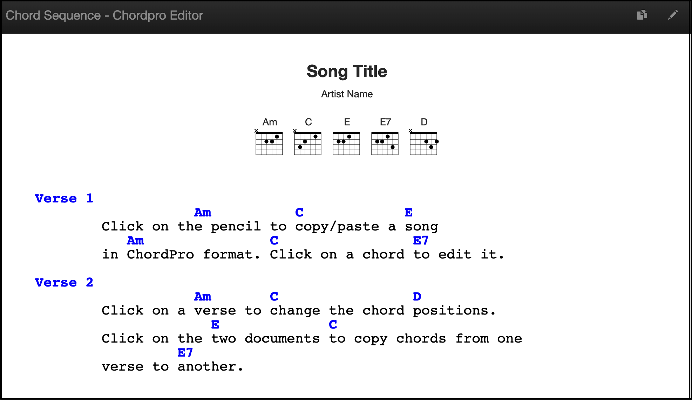
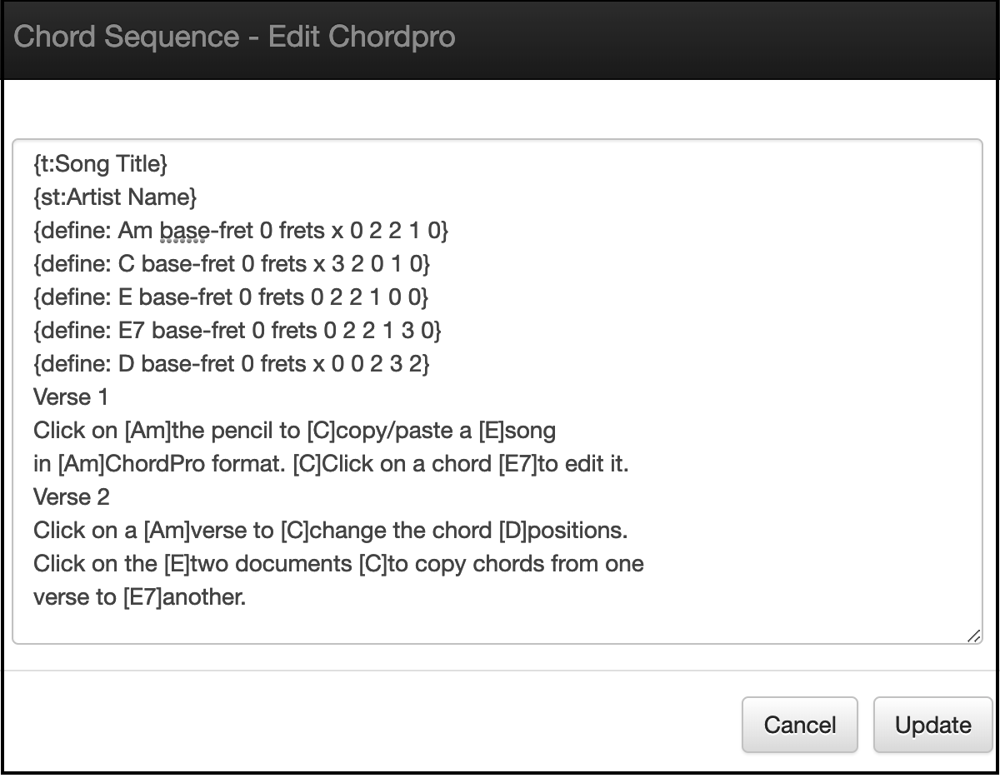
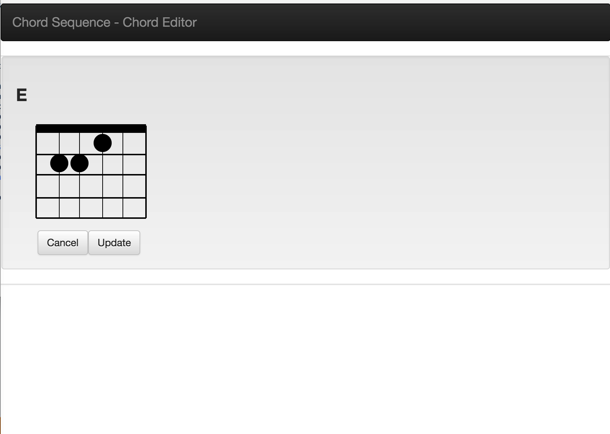

# chordpro-editor
Simple chordpro editor





## run
```
docker run -p 3000:3000 -d --name chordpro-editor jimareed/chordpro-editor
```
> browse to http://localhost:3000

## cleanup
```
docker stop chordpro-editor
docker rm chordpro-editor
```

## configure mongo

replace the following line in db.js with the mongo connection string (e.g., mongodb://localhost/chordpro)
```
mongoose.connect('__mongo_connection_string__',function() {
  ```

## verify setup

```
cd /opt/chordpro-editor
./node_modules/.bin/mocha tests
```

## build and run docker container locally
```
docker build --tag chordpro-editor-image .
docker run --name chordpro-editor -p 3000:3000 -d chordpro-editor-image
```
## clean up
```
docker stop chordpro-editor
docker rm chordpro-editor
docker rmi chordpro-editor-image
```

## build and run server locally
```
npm install
node server
```