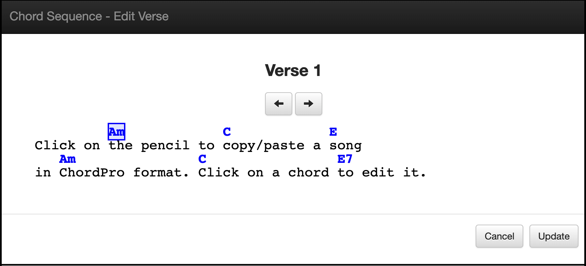

# chordpro-editor
Hobby project using the MEAN stack.  Chordpro-editor is a simple editor for editing guitar songs in the ChordPro format. It's useful when the online version of a song isn't quite the way you like to play it.

<p  align="center">
    <kbd></kbd>
</p>
<br/><br/>


Click on the chord at the top of the song to change the chord or the chord position (i.e., change to a different chord inversion).  
<p align="center">
  <kbd></kbd>
</p>
<br/><br/>

Click on the pencil icon at the top right to edit the song lyrics.  
<p  align="center">
    <kbd></kbd>
</p>
<br/><br/>

Click on the Verse to change the location of the chord in the the lyrics.
<p  align="center">
    <kbd></kbd>
</p>
<br/><br/>


## run
```
docker run -p 3000:3000 -d --name chordpro-editor jimareed/chordpro-editor
```
> browse to http://localhost:3000

## cleanup
```
docker stop chordpro-editor
docker rm chordpro-editor
```

## configure mongo

replace the following line in db.js with the mongo connection string (e.g., mongodb://localhost/chordpro)
```
mongoose.connect('__mongo_connection_string__',function() {
  ```

## verify setup

```
cd /opt/chordpro-editor
./node_modules/.bin/mocha tests
```

## build and run docker container locally
```
docker build --tag chordpro-editor-image .
docker run --name chordpro-editor -p 3000:3000 -d chordpro-editor-image
```
## clean up
```
docker stop chordpro-editor
docker rm chordpro-editor
docker rmi chordpro-editor-image
```

## build and run server locally
```
npm install
node server
```