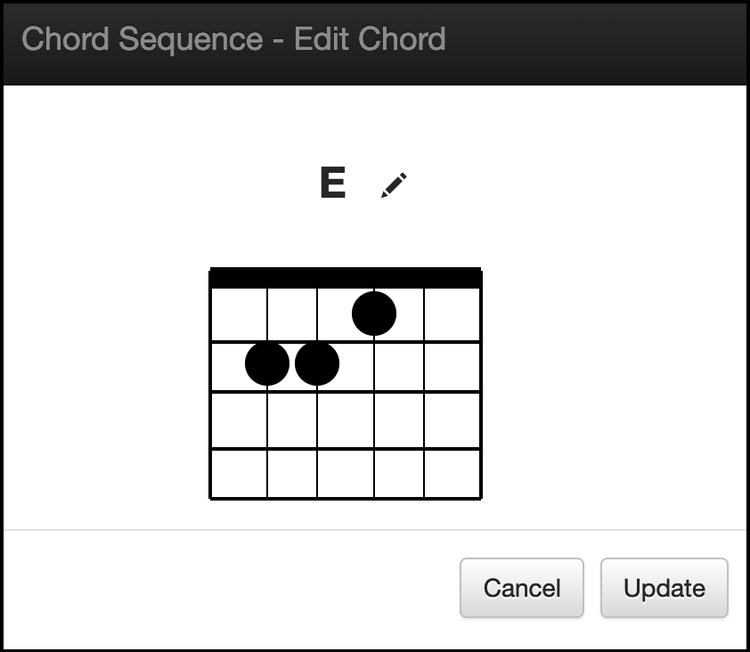

# chordpro-editor
Simple chordpro editor




## setup

```
install project
install docker
build and run
```


## install project

```
cd /opt
git clone https://github.com/jimareed/chordpro-editor
```

## install docker
```
sudo yum install -y docker
sudo service docker start
```

## build and run
```
cd /opt/chordpro-editor
docker build -t chordpro-editor-image .
docker run -p 3000:3000 -d --name chordpro-editor chordpro-editor-image
```

## cleanup
```
docker stop chordpro-editor
docker rm chordpro-editor
```

## configure mongo

replace the following line in db.js with the mongo connection string (e.g., mongodb://localhost/chordpro)
```
mongoose.connect('__mongo_connection_string__',function() {
  ```

## verify setup

```
cd /opt/chordpro-editor
./node_modules/.bin/mocha tests
```
